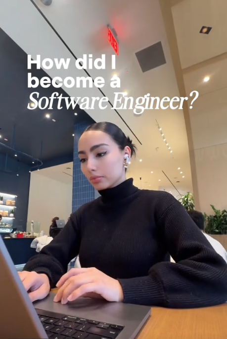

# Generate trendy narrated videos (GRWM, day in the life) with AI — fully automated.



Give it some clips and a prompt like *"GRWM as a 9-5 software engineer"* and it writes the script, clones your voice, edits the footage, and burns styled captions. You end up with a post-ready video without touching a timeline.

## How it works

1. **Voice cloning** — captures your voice from a sample so narration sounds like you
2. **Script generation** — an AI agent writes narration based on your clips and the vibe you want
3. **AI editing** — cuts and arranges your clips to match the narration timing
4. **Auto captions** — transcribes the narration and places styled captions that match the aesthetic

## Getting Started

### 1. Main project

```bash
python3 -m venv venv
source venv/bin/activate
pip install -r requirements.txt
```

Copy the example env file and fill in your values:

```bash
cp .env.example .env
```

At minimum you need a Gemini API key — get one at [aistudio.google.com](https://aistudio.google.com):

```
GEMINI_API_KEY=your_key_here
```

> **Heads up:** the default models (`gemini-3.1-pro-preview`, `gemini-2.5-pro`) require a paid Google AI Studio plan. See `.env.example` for all configurable values.

### 2. Voice clone server

> **Mac (Apple Silicon) only.** The voice clone server depends on [MLX](https://github.com/ml-explore/mlx), Apple's machine learning framework built specifically for Apple Silicon (M1/M2/M3/M4). It talks directly to the GPU through Apple's Metal API via the `mlx-metal` package, so it has no CUDA or cross-platform path — it simply won't run on Linux or Windows. The rest of the pipeline (script generation, editing, captions) works anywhere.
>
> **Running on a different machine?** The `CLONE_TTS_URL` env var is intentionally the only thing that connects the main pipeline to the TTS server. If you're not on a Mac, you can point that URL at any HTTP endpoint that accepts `POST {"text": "..."}` and returns `{"file_path": "..."}` — a cloud TTS service, ElevenLabs, a self-hosted Coqui server, etc. You'd just need to write a small wrapper server that matches that interface and update the URL in `.env`.

The voice clone server runs as a separate process with its own dependencies.

```bash
cd voice-clone
python3 -m venv venv
source venv/bin/activate
pip install -r requirements.txt
```

**Record a reference audio sample** — speak clearly for 15–30 seconds into a WAV file. Then transcribe it using the Whisper model that ships with `mlx-audio`:

```bash
python3 -m mlx_audio.stt.generate \
  --model mlx-community/whisper-large-v3-turbo-asr-fp16 \
  --audio your_voice.wav \
  --output-path transcript.txt
```

Set the required env vars in the root `.env`:

```
VOICE_CLONE_MODEL_ID=mlx-community/Qwen3-TTS-12Hz-0.6B-Base-bf16
VOICE_CLONE_REF_AUDIO=/absolute/path/to/your_voice.wav
VOICE_CLONE_REF_TEXT=/absolute/path/to/transcript.txt
```

Start the server (leave it running in a separate terminal):

```bash
./venv/bin/python server.py
```

### 3. Run

Back in the main project:

## Usage

```bash
python3 editor.py "grwm as an indie software engineer working remote" --ref ref.mp4 videos/*.mp4
```

`--ref` is optional. Pass it a video whose editing style you want to emulate — pacing, energy, color grade, mood — and the pipeline will analyze it and match that style in the output. Leave it out and the editor will make its own creative decisions.

## Examples

- [Example 1](https://github.com/dslogs/videoai/issues/1)
- [Example 2](https://github.com/dslogs/videoai/issues/2)
